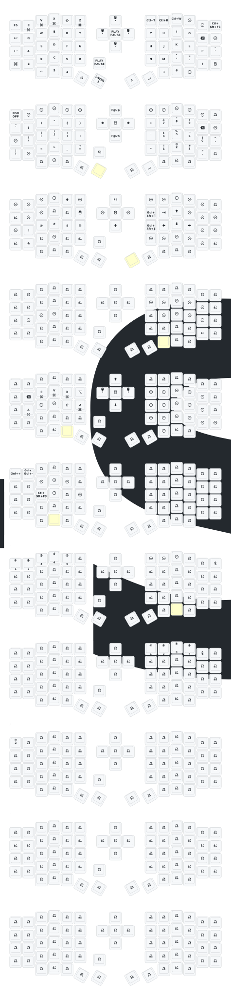

# zmk-config-sofle

## Default Keymap
 

## Keyremap 

 
[Keymap Editor](https://nickcoutsos.github.io/keymap-editor/)  
[Github, Keymap Editor Setup and Flashing](https://github.com/superxc3/zmk_config_sofle#steps) - using Sofle wireless as reference 

## Notes
### Flashing
1. If you only change the keymap, you can just flash to the master side. For Sofle series, master is on the left. That means you dont need to flash left and right. 
 
2. If double press doesnt call out the new folder to drag your uf2, check MY COMPUTER any new drive, or you have to double press even faster. You also can use key combination above by holding thumb and press the green button twice.
3. You dont need to delete any files in nicenano folder, just drag your new right uf2 to it and ignore and skip any error.
4. Normally doesnt need to re-pair after format. It will paired automatically.
   
### Charging
5. You can just plug in cable and flip the power button on to charge. Push to down on both sides to turn on the keyboard.
6. You can charge both sides togehter. Slave (left) normally lasts longer than the master (right).
7. If you want to make sure flawless connection, you can plug in cable to right and use as wired mode. Left doesnt need to plug in wire and remains wireless.
8. If you want to keep your battery healthy yet want to make sure flawless connection, you can flip the power button off and plug in cable to right. This makes sure the board is using in wired mode but doesnt always charge the battery.

